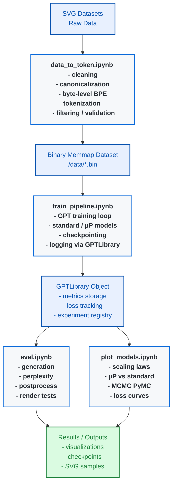

# SVG Scaling Law Experiment Codebase

This repository contains the full pipeline for training, evaluating, and analyzing scaling laws in autoregressive SVG generation models. The project is built around a GPT-style transformer architecture adapted from **nanoGPT (Karpathy)**, with extensions for structured SVG modeling and Maximal Update Parameterization (**μP**, Yang et al.).

The codebase is organized so that **all experiments are reproducible from notebooks**, while core logic is implemented in modular Python files.

---

## Overview

The system supports:

- Training standard and μP transformer models on SVG sequences
- Byte-level tokenization with structured preprocessing
- Scaling law fitting (deterministic + Bayesian MCMC via PyMC)
- Unconditional and conditional SVG generation
- Full evaluation pipeline (loss, perplexity, render validity)
- Automated logging, checkpointing, and visualization

---

## Design Notes

- Model architecture is heavily based on **nanoGPT**
- μP is used for width-invariant training dynamics and scaling analysis
- Context length is fixed at **512 tokens**
- Vocabulary size is fixed at **8000 tokens**
- Training runs are optimized for GPU execution (CUDA recommended, not required)
- Most experimentation is designed around comparing **standard vs μP scaling behavior**

---

## Pipeline Diagram

Below is the overall experimental workflow of the project:



---

## Repository Structure

### Notebooks (Experiment Pipelines)

All `.ipynb` files are **end-to-end experiment pipelines**:

- `train_pipeline.ipynb` → main training entry point
- `eval.ipynb` → generation + test evaluation (loss, perplexity, rendering, post-processing)
- `plot_models.ipynb` → scaling law fitting + visualization (standard vs μP)
- `data_to_token.ipynb` → full dataset cleaning + tokenization pipeline

---

### Core Python Modules

#### `train_funcs.py`
Contains all training utilities:
- training loop
- batching logic
- LR scheduling
- checkpoint saving
- evaluation hooks

#### `model_design.py`
Defines the full GPT architecture:
- nanoGPT-based transformer backbone
- μP-compatible initialization
- attention, MLP, and block structure
- generation function (top-k sampling, temperature scaling)

#### `gpt_library.py`
A high-level experiment manager that:
- Stores multiple trained models
- Logs training metrics (loss, perplexity, etc.)
- Provides dataframe access to results
- Handles plotting utilities
- Runs scaling law fitting (deterministic + PyMC MCMC)

#### `global_config.py`
Central configuration file containing:
- Model configs (STANDARD, μP, BASE, DELTA, BEST)
- Training hyperparameters
- Dataset paths
- Tokenization settings
- Vocabulary size (8000)
- Block size (512)
- Learning rate schedules
- Device configuration (CUDA if available)

---

## Running Experiments

### 1. Create a GPT library

All experiments are managed through a `GPTLibrary` object.

```python
from gpt_library import GPTLibrary
from global_config import STANDARD_CONFIG

library = GPTLibrary(STANDARD_CONFIG)
```

### Configuration Setup

A config is a dictionary of `GPTConfig` objects:

```python
STANDARD_CONFIG = {
    "tiny": GPTConfig("tiny", 128, 4, 4, 512, VOCAB_SIZE, BLOCK_SIZE, False, 0),
    "small": GPTConfig("small", 192, 6, 6, 768, VOCAB_SIZE, BLOCK_SIZE, False, 0),
}
```

### 2. Train Models

```python
run_train_pipeline(library, file_prefix, mup_bool, train_best_bool)
```

**Behavior:**
- **Default:** Trains 1 epoch per model in the library.
- **If `train_best = True`:**
  - Runs full training schedule (from config epochs).
  - Disables LR sweep.
  - Uses fixed learning rate from config.

### 3. Evaluate Models

Run via: `eval.ipynb`

**Includes:**
- Unconditional generation
- Conditional generation
- Test set perplexity
- Post-processing (XML repair, truncation fixes)
- Render validation

### 4. Plot Scaling Laws

Run via: `plot_models.ipynb`

**Supports:**
- Standard vs μP comparison
- Loss curves
- Log-log scaling fits
- Bayesian MCMC scaling law estimation (PyMC)

> **Note:** All functions support a `mup=True/False` flag to automatically switch datasets.

---

## GPTLibrary Usage

```python
df = library.get_df()
```

- **Default** → Summary metrics
- `full=True` → Full loss curves (time series dataframe)

---

## System Configurations

### μP Support

If using μP:
- `BASE_CONFIG` and `DELTA_CONFIG` must be defined in `global_config.py`.
- Model uses:
  - MuReadout head
  - μP initialization rules
  - Width-stable optimization scaling

### Data Pipeline

**Tokenization:**
- Byte-level BPE tokenizer
- Strict canonicalization of SVG
- Outputs stored as `.bin` memmap files
- Saved automatically to: `/data`

### Training Outputs

Automatically saved:
- **Checkpoints** → `/training_checkpoints`
- **GPTLibrary objects** → Saved per epoch
- **Visualizations** → `/visualizations`
- **Tokenized datasets** → `/data`

---

## Dependencies

- `torch` (PyTorch)
- `numpy`, `pandas`, `matplotlib`, `seaborn`
- `pymc`
- `mup`
- `huggingface` (tokenizer & cosine scheduler)
- `pillow` (PIL), `cairosvg`
- `pickle`

---

## System Notes

- CUDA is recommended but not required.
- CPU training is supported (slower).
- Main bottlenecks: Memory + sequence length, not compute.
- Designed for reproducible scaling law analysis.

---

## Model Architecture Summary

Based on nanoGPT, the model includes:
- Causal self-attention
- Learned positional embeddings
- GELU MLP blocks
- Optional μP scaling support
- Untied embeddings in this setup

**μP Behavior:**
- Stabilizes training across widths.
- Improves scaling law comparability.
- Reduces sensitivity to hyperparameter tuning.

---

## Workflow

1. **Preprocess** → `data_to_token.ipynb`
2. **Train** → `train_pipeline.ipynb`
3. **Evaluate** → `eval.ipynb`
4. **Analyze** → `plot_models.ipynb`